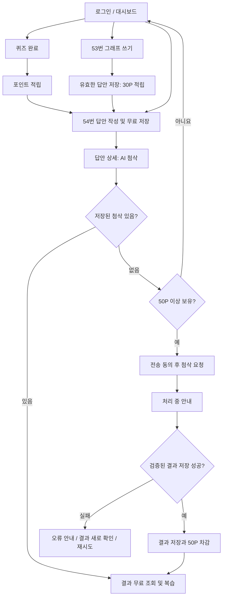
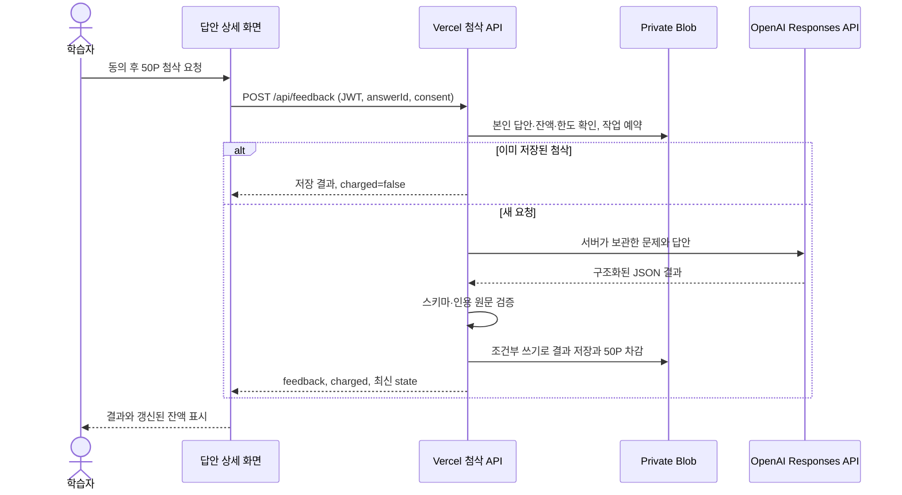

# 스프린트 미션 8 — 고도화 기능 설계 및 흐름 정의

## 1. 서비스와 선택한 기능

**서비스:** 옥토퍼스 토픽 — 퀴즈와 쓰기 연습을 통해 TOPIK 학습을 지속하는 서비스.

**선택 분야:** OpenAI API 활용 기능.

**구현 기능:** 학습 포인트 50P를 사용해 저장된 TOPIK II 54번 답안의 AI 맞춤 첨삭을 받고, 결과를 다시 확인한다.

기존 MVP에서는 퀴즈, 53번 그래프 쓰기, 54번 답안 저장과 공통 안내를 제공했다. 그러나 학습자는 자신의 글에서 어떤 부분을 개선해야 하는지 구체적으로 알기 어려웠다. 이번 기능은 개별 답안의 내용·구성·표현에 대한 조언을 제공하고, 매일 모은 포인트를 심화 학습에 사용하는 이유를 만든다.

## 2. MVP 구현 범위

| 이번에 반드시 제공하는 기능 | 구현 범위 |
| --- | --- |
| 개인 답안 첨삭 | 본인이 저장한 600~700자의 54번 답안 |
| 첨삭 요청 | 비용·전송 내용을 확인하고 동의한 뒤 요청 |
| 결과 | 총평, 잘한 점, 개선할 점, 문장 수정과 이유, 다음 연습 제안 |
| 포인트 사용 | 결과 저장과 동시에 50P 차감 |
| 복습 | 저장된 결과 재조회, 추가 차감 없음 |
| 실패 대응 | 포인트 부족·처리 지연·API 오류·저장 상태 확인 안내 |
| 중복 방지 | 사용자당 동시 작업 1건, 동일 답안의 저장된 결과 재사용 |

결제, 53번 AI 첨삭, 공식 점수 예측, 전체 답안 대필, 자유 대화, 답안 버전별 재첨삭은 이번 범위에 포함하지 않는다. 과거 지급 포인트는 유지한다.

## 3. 기존 MVP 안에서의 위치

**권장 학습 흐름: 퀴즈 → 53번 그래프 쓰기 → 포인트를 사용한 54번 맞춤 첨삭 → 복습**

순서는 강제하지 않는다. 이미 50P 이상을 보유한 사용자는 바로 54번을 작성하고 첨삭받을 수 있다. 54번 답안 저장 자체는 무료이며 신규 포인트를 지급하지 않는다.

## 4. 사용자 기준의 입력과 결과

| 단계 | 언제 사용하는가 | 사용자 입력 | 얻는 결과 |
| --- | --- | --- | --- |
| 퀴즈 | 짧은 일일 학습을 시작할 때 | 문제별 정답 선택 | 채점, 완료 20P와 정답당 10P |
| 53번 | 그래프 설명을 연습할 때 | 200~300자 답안 | 답안 저장, 동일 문제·날짜에 30P 1회 적립 |
| 54번 저장 | 논리적인 긴 글을 연습할 때 | 600~700자 답안 | 무료 답안 저장과 상세 화면 이동 |
| 첨삭 요청 | 내 글의 개선점을 알고 싶을 때 | 답안 전송 동의와 요청 버튼 | 처리 중 안내, 성공 시 맞춤 첨삭과 50P 사용 |
| 결과 복습 | 다음 글을 쓰기 전·학습 기록을 볼 때 | 저장된 답안 선택 | 같은 첨삭을 추가 비용 없이 확인 |

첨삭 API에는 `answerId`와 `consent: true`만 보낸다. 문제·답안·포인트는 서버의 저장값을 사용한다. 모델에는 문제와 답안 본문만 전달하며 계정의 이름·이메일을 전달하지 않는다. 사용자가 답안에 개인정보를 적지 않도록 안내한다.

## 5. 정상 시나리오

1. 신규 사용자가 로그인하고 퀴즈 3문제를 모두 맞힌다. 보유 포인트는 50P가 된다.
2. 53번을 200~300자로 작성해 저장한다. 30P가 추가되어 80P가 된다.
3. 54번 문제를 읽고 600~700자로 작성한다. 무료 저장 후에도 80P다.
4. 답안 상세에서 50P 비용, 학습용 분석 안내, 전송 동의를 확인한다.
5. 동의 후 요청하면 중복 클릭을 막고 처리 중 상태를 표시한다.
6. 서버가 AI 결과의 형식과 인용 원문을 검증한 뒤 결과와 포인트 차감을 함께 저장한다.
7. 사용자는 총평·장점·개선점·문장별 수정 이유·다음 연습 제안을 확인한다. 잔액은 30P다.
8. 새로고침하거나 같은 답안에 다시 요청해도 저장된 결과를 보여주며 잔액은 30P다.

## 6. 실패·로딩·빈 상태 설계

| 상황 | 사용자 안내와 동작 | 포인트 및 서버 처리 |
| --- | --- | --- |
| 동의하지 않음 | 요청 버튼 비활성화 | 외부 호출 없음; 서버도 동의 누락 거절 |
| 50P 미만 | 부족 안내와 학습 화면 링크 | 외부 호출·차감 없음 |
| 글자 수 오류 | 작성 화면에서 수정 안내 | 서버에서 재검증 후 저장 거절 |
| 처리 중 | 로딩 문구, 버튼·동의 체크박스 비활성화 | 사용자당 작업 1건 예약 |
| 다른 탭에서 첨삭 중 | 진행 중 안내와 결과 확인 유도 | 중복 외부 호출 방지 |
| 연결 실패·시간 초과 | 오류 설명과 재시도 가능 | 결과가 저장되지 않으면 차감 없음 |
| AI 거절·미완성·잘못된 인용 | 결과 확인 실패 안내 | 잘못된 결과 저장·차감 없음 |
| 저장 응답 유실 | 서버 재조회로 완료 여부 확인 | 이미 저장된 결과를 우선 반환 |
| 저장 상태도 확인 불가 | 새로고침해 결과·잔액 확인 안내 | 성공 또는 실패를 임의로 단정하지 않음 |
| 수정할 문장 없음 | 문장 수정이 없음을 설명 | 총평·구성 조언·다음 연습은 표시 |
| 하루 요청 한도 초과 | 다음 날 이용 안내 | KST 기준 외부 호출 시도 최대 5회 |
| API 키 미설정 | 서비스 설정 중 안내 | 외부 호출·차감 없음 |

## 7. 프론트엔드와 백엔드 연결

저장된 결과는 `answers[].aiFeedback`에 보관한다. 결과에는 고유 ID, 작성 시각, 비용, 모델과 프롬프트 버전이 포함된다. 작업 예약은 `feedbackJob`, 일일 횟수는 `feedbackUsage`로 관리한다.

모든 사용자 상태 변경은 ETag 조건부 쓰기를 사용한다. 퀴즈 적립과 첨삭 차감이 동시에 발생하면 최신 문서를 다시 읽고 갱신하며, 최대 8회 충돌 후에는 실패를 반환한다. 외부 AI 호출은 저장 재시도 콜백 밖에 두어 저장 충돌 때문에 모델을 재호출하지 않는다. 프론트엔드는 사용자와 revision을 확인해 늦게 도착한 응답이 최신 잔액을 덮어쓰지 않도록 한다.

## 8. 기술 선택과 단순화 이유

| 선택 | 이유 | MVP 단계의 한계 |
| --- | --- | --- |
| 기존 React/Vite와 Vercel Functions 유지 | 미션 6·7의 화면·인증·배포 구조 재사용 | 동기 함수 실행 시간 안에 처리해야 함 |
| 서버에서 Responses API 직접 호출 | 단일 첨삭 기능에 별도 AI 프레임워크 없이 연결 | 오류 처리와 검증을 직접 관리 |
| 기본 모델 `gpt-4.1-mini` | 텍스트 첨삭용 초기 모델로 설정, 환경 변수로 교체 가능 | 실제 학습자 답안으로 품질 평가를 계속해야 함 |
| Structured Outputs와 Zod | 화면에 필요한 항목과 자료형을 안정적으로 확보 | 구조 검증이 내용의 정확성을 보장하지 않음 |
| Private Blob 사용자 문서 | 기존 데이터를 유지하고 결과·차감을 같은 쓰기로 저장 | 기록 증가 시 문서가 커져 DB·페이지 조회 전환 필요 |
| 답안당 저장 결과 1개 | 반복 과금과 결과 관리 복잡도를 줄임 | 수정본 비교·버전별 첨삭은 후속 기능 |

## 9. 환경·보안·확장 가능성

- API 키는 Vercel 서버 환경 변수 `OPENAI_API_KEY`로 관리한다. 클라이언트용 접두사를 붙이거나 Git에 저장하지 않는다.
- JWT 인증, 답안 소유권, 서버 문제 목록, 글자 수, 포인트, 전송 동의를 검증한다.
- 답안에 포함된 지시를 모델 명령으로 취급하지 않도록 프롬프트에서 구분하고, 응답은 HTML이 아닌 텍스트로 표시한다.
- 공식 TOPIK 점수·기관 제휴를 주장하지 않는다. 결과는 학습을 돕는 AI 분석이다.
- 외부 호출은 45초로 제한하고 작업 예약은 2분 후 재시도할 수 있다. 사용자가 늘면 작업 큐·비동기 조회와 트랜잭션 데이터베이스로 확장할 수 있다.
- 다른 첨삭 유형은 현재 생성·검증 함수를 바탕으로 별도 프롬프트와 정책을 추가할 수 있다. 결제·인증 고도화도 기존 학습 흐름에 연결할 수 있다.
- 데모 인증의 이메일 인증·비밀번호 재설정·다중 계정 남용 방어는 실제 대규모 운영 전 별도 과제다.

## 10. 제출 자료와 검증 근거

- [공개 GitHub 저장소](https://github.com/hellolinkproject-code/octopus-topic-mvp)
- [배포 서비스](https://octopus-topic-mvp.vercel.app)
- [구현 상세 및 검증 기록](MISSION8.md)
- [프로젝트 실행 방법](../README.md)

최종 제출 판단은 구현 설명뿐 아니라 실제 배포의 AI 성공, 저장·차감·재조회와 실패 테스트 결과를 함께 확인한다. 최신 검증 결과는 `MISSION8.md`의 검증 기록에 남긴다.
